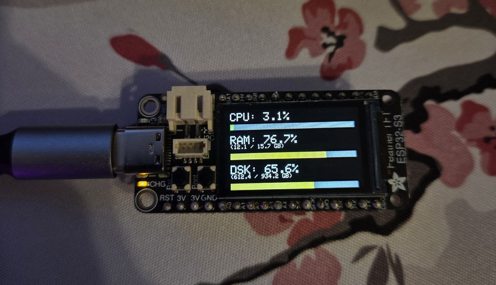

# ESP32‑S3 TFT PC stats monitor
A simple project that turns your Adafruit ESP32‑S3 TFT Feather into a PC performance monitor. No extra modules required.
The ESP32 retrieves system statistics from a lightweight Python server and displays them on its built‑in 135×240 TFT screen. PC statistics are updated every second.

The ESP32 connects to Wi-Fi, requests system statistics from the server, and displays:
- CPU usage
- RAM usage
- Disk usage

## Features
- No external modules needed (unless your esp32 has a built-in TFT screen)
- Simple Python backend using *psutil*
- Wi‑Fi auto‑connect with on‑screen status

## Hardware
- Adafruit ESP32‑S3 TFT Feather
- Your PC
- USB‑C cable or an external battery to power the esp32

## How it works
1. Your PC runs a Python server (`pc_stats.py`) that collects system statistics using `psutil`
2. The server exposes an endpoint: `http://<your_pc_ip>:<port>/pc_stats`
3. The ESP32 sends HTTP GET requests to this endpoint once per second
4. The server responds with a JSON object containing CPU, RAM, and disk usage
5. The ESP32 parses the JSON and updates the display

## Network Requirements
The ESP32 and your PC must be connected to the same Wi‑Fi network.
This is required because the ESP32 accesses your PC using a local IP address.

## Setup
### 1. Install Python dependencies
```
pip install flask psutil
```

### 2. Run the PC stats server
```
python pc_stats.py
```
This starts a local server on port 5555 by default.

### 3. Find your PC’s local IP address
Open terminal and type:
```
ipconfig
```
There you will see:
```
IPv4 Address . . . . . . . : 192.168.x.x
```
Use this IP in your ESP32 code:
```
String serverURL = "http://192.168.x.x:5555/pc_stats";
```
Your IP may change depending on your router.
If the ESP32 stops receiving data, check your IP again.

### 4. ESP32 configuration
In `pc_stats.ino` update:
```
const char* ssid = "your_ssid";
const char* password = "your_password";
String serverURL = "your_url";
```
- ssid -> the name of your Wi‑Fi network
- password -> your Wi‑Fi password
- serverURL -> the URL address of your localhost Python server

### 5. Uploading to the ESP32‑S3
1. Install the ESP32 board package in Arduino IDE
2. Select in Tools -> Board:
  **Adafruit Feather ESP32‑S3 TFT**
3. Install required libraries which are listed in the beginning of the esp32 sketch
4. Upload the sketch

## Demo

